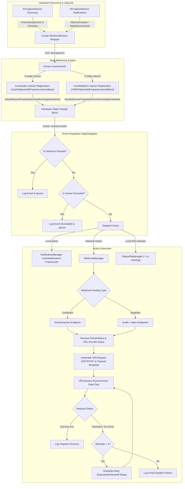

# In Meeting Architecture

This document details the architectural design, component structure, and data flows of **In Meeting**, a native macOS utility that monitors real-time camera and microphone activity to coordinate home automation webhooks, local notifications, and system status indicators.

---

## 1. High-Level Design Principles

1. **Zero Polling & Low Overhead**: Rather than running heavy shell tasks or streaming macOS unified logs (`log stream`), the application subscribes directly to low-level macOS hardware event listeners via CoreAudio and CoreMediaIO. This ensures zero idle CPU load and immediate reaction times.
2. **Dynamic Hardware Lifecycle**: Devices can be plugged in or removed at any time (e.g., USB webcams, Bluetooth headsets, Continuity Camera). The app dynamically attaches listeners upon device connection and cleanly unregisters them upon disconnection.
3. **Flexible Event Dispatching**: State changes are routed through configurable action handlers—local user notifications, atomic filesystem status indicators, and HTTP/HTTPS webhooks with retry capabilities.
4. **Strictly Local & Privacy-Preserving**: All device monitoring happens strictly on-device. No telemetry, usage statistics, or analytics are collected or transmitted.

---

## 2. System Architecture Diagram

---

## 3. Core Subsystems

### 3.1 Hardware Discovery & Hot-Plugging
- **Initial Discovery**: Upon startup, `AppDelegate` initializes an `AVCaptureDevice.DiscoverySession` targeting `.builtInWideAngleCamera`, `.externalUnknown`, and `.microphone` device types.
- **Dynamic Hot-Plugging**: Listens to system notifications:
  - `AVCaptureDeviceWasConnectedNotification`: Inspects the newly attached device, wraps it into a `MonitoredDevice`, queries its connection ID, registers listener blocks, and adds it to the Menu Bar device list.
  - `AVCaptureDeviceWasDisconnectedNotification`: Unregisters active listener blocks and removes the device from the tracked registry.

### 3.2 Hardware Property Introspection & State Monitoring
Instead of parsing system log output, In Meeting monitors private hardware registers:
1. **Connection ID Extraction**: Dynamically checks if the `AVCaptureDevice` responds to the selector `connectionID` and queries its integer value via Key-Value Coding (`device.value(forKey: "connectionID")`).
2. **CoreAudio Listener (Microphones)**:
   - Registers a listener block using `AudioObjectAddPropertyListenerBlock`.
   - Uses selector `kAudioDevicePropertyDeviceIsRunningSomewhere` (`'gone'`) scoped to `kAudioObjectPropertyScopeGlobal`.
3. **CoreMediaIO Listener (Cameras)**:
   - Registers a listener block using `CMIOObjectAddPropertyListenerBlock`.
   - Uses selector `kAudioDevicePropertyDeviceIsRunningSomewhere` (`'gone'`) scoped to `kCMIOObjectPropertyScopeGlobal`.
4. **State Transition Detection**: When triggered, reads the property value (`UInt32`). A value of `1` indicates capture is active; `0` indicates capture has ended.

### 3.3 Event Routing & Filtering
Before triggering alerts or network calls, transitions pass through two filter gates:
1. **Paused State**: Detection can be paused globally via the Menu Bar menu ("Pause Detection"). When paused, events are logged to stdout but no actions are dispatched.
2. **Device Exclusion**: Users can toggle monitoring for individual devices directly in the status menu. Excluded device UUIDs are stored in `UserDefaults` (`excludedDeviceUUIDs`) and ignored during event dispatching.

### 3.4 Action Execution Targets

#### Local Notifications (`NotificationManager`)
- Requests user authorization via `UNUserNotificationCenter`.
- When an active or inactive transition occurs, posts a local banner with formatted title and body describing which device changed state.

#### Status File Indicator (`StatusFileManager`)
- Atomically maintains `~/.in-meeting` containing `"active"` or `"inactive"`.
- Designed for integration with external shell scripts, terminal prompts, and status bars (such as SketchyBar, yabai, or tmux).

#### Webhook Dispatch Engine (`WebhookManager`)
- **Endpoint Routing**: Supports Combined URLs (single Active/Inactive endpoints) or Separate URLs (individual endpoints for Audio Active, Audio Inactive, Video Active, and Video Inactive).
- **HTTP Methods**: Supports `GET` and `POST`.
- **Placeholder Tokens**: Replaces `{{device_name}}`, `{{device_type}}`, `{{device_status}}`, and `{{timestamp}}`. Query string replacements are percent-encoded (`urlEncode: true`) to preserve valid URL syntax with spaces and special characters.
- **Fault Tolerance**: Network failures or HTTP 5xx responses trigger background retries up to 3 times with exponential backoff (`pow(2.0, attempt) * 1.0` seconds).

### 3.5 Status Bar Interface & Settings UI
- **Menu Bar Accessory**: Configured with `.accessory` activation policy so the application does not occupy Dock space or present a default window.
- **Dynamic Icons**: Reflects status in real-time (`video`, `record.circle.fill`, `video.slash`).
- **Settings View**: SwiftUI interface hosted in `SettingsWindowController`, featuring tabs for General, Webhooks, Notifications, and Status File settings, alongside an interactive webhook test utility.

---

## 4. Component Mapping

| Component | Primary File | Responsibilities |
| :--- | :--- | :--- |
| **App Lifecycle & Discovery** | [`AppDelegate.swift`](In%20Meeting/AppDelegate.swift) | App initialization, `AVCaptureDevice` discovery, hot-plug notifications, CoreAudio/CoreMediaIO listeners, status menu construction. |
| **Notification Engine** | [`NotificationManager.swift`](In%20Meeting/NotificationManager.swift) | User notification permissions, banner formatting, and local alert delivery. |
| **Status File Manager** | [`StatusFileManager.swift`](In%20Meeting/StatusFileManager.swift) | Atomic disk writes and file cleanup for `~/.in-meeting`. |
| **Webhook Engine** | [`WebhookManager.swift`](In%20Meeting/WebhookManager.swift) | URL placeholder resolution, payload assembly, asynchronous HTTP execution, retry backoff. |
| **Settings Storage** | [`SettingsManager.swift`](In%20Meeting/SettingsManager.swift) | `UserDefaults` persistence, Launch at Login coordination via `SMAppService`. |
| **Settings UI** | [`SettingsView.swift`](In%20Meeting/SettingsView.swift) | SwiftUI configuration screens and webhook testing UI. |
| **Window Hosting** | [`SettingsWindowController.swift`](In%20Meeting/SettingsWindowController.swift) | Native `NSWindowController` managing the settings window lifecycle. |

---

## 5. Security & Entitlements

- **App Sandbox**: The application runs with `com.apple.security.app-sandbox` set to `false` in [`In_Meeting.entitlements`](In%20Meeting/In_Meeting.entitlements). This entitlement configuration is required to register CoreAudio and CoreMediaIO property listener blocks across the entire system.
- **Device Usage Descriptions**: `NSCameraUsageDescription` and `NSMicrophoneUsageDescription` are declared in `Info.plist` to comply with macOS hardware enumeration requirements.
- **Zero Third-Party Dependencies**: Built exclusively with Apple system frameworks (`Cocoa`, `AVFoundation`, `CoreAudio`, `CoreMediaIO`, `UserNotifications`, `ServiceManagement`, `SwiftUI`).
