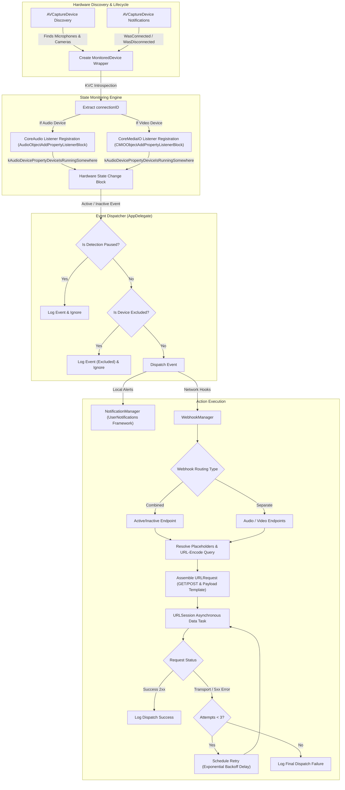

# In Meeting - macOS Camera/Microphone Status Monitor

**In Meeting** is a native macOS utility built for smart home enthusiasts and privacy-conscious users. Whether you want to toggle a physical "Do Not Disturb" status light outside your home office door using Home Assistant webhooks, or you want to be alerted instantly with a macOS notification whenever a background application silently accesses your camera or microphone, **In Meeting** handles it seamlessly.

A lightweight macOS utility that instantly triggers webhooks to update your home automation status lights (free/busy) and displays native notifications the second any app accesses your camera or microphone. Unlike heavy log-polling scripts, it relies entirely on native macOS framework observers, resulting in near-zero CPU and battery impact.


---

## Key Features

- **Direct Hardware Observers**: Connects directly to CoreAudio (microphones) and CoreMediaIO (cameras) registry notifications to detect state transitions instantly.
- **Menu Bar Status Integration**: Runs exclusively as a Menu Bar accessory with outline, recording, and slash icons representing current idle, active, or paused states.
- **Selectable Device Exclusions**: Allows toggle-clicking on any monitored device in the status bar menu. Unchecked devices are excluded from triggering local notifications or webhooks.
- **Launch at Login**: Integrates with the modern macOS 13+ `SMAppService` API to launch automatically when you log in.
- **Webhook Integrations**:
  - Supports **Combined URLs** (sending all video/audio events to single active/inactive endpoints) or **Separate URLs** (individual URLs for audio active, audio inactive, video active, and video inactive).
  - Supports **GET** and **POST** methods.
  - Safely **percent-encodes** parameter placeholder values (like `{{device_name}}`) in URL queries to support devices with spaces or parentheses.
  - Custom JSON payload builder for POST requests with placeholder tokens (`{{device_name}}`, `{{device_type}}`, `{{device_status}}`, `{{timestamp}}`).
  - **Fault Tolerance**: Automatic background retries up to **3 times** with exponential backoff on connection or server (5xx) errors.
- **Local macOS Notifications**: Triggers native User Notification banners with status summaries matching PRD guidelines.
- **UI Settings Panel**: A clean, modern SwiftUI window that avoids typical macOS Form alignment bugs.
- **Privacy First & MIT Licensed**: Features zero telemetry, zero analytics tracking, and zero external queries. All device observations remain local, and webhook requests are made directly to user targets. The codebase is fully open source under the MIT License.

---

## Architecture Overview



---

## System Requirements

- **Operating System**: macOS 13.0+
- **Sandbox Status**: Disabled (`com.apple.security.app-sandbox` set to `false` in entitlements to allow access to global hardware CoreAudio/CoreMediaIO registers).

---

## Privacy First

**In Meeting** values your confidentiality:
- **Zero Telemetry**: No tracking data, usage logs, or crash reports are uploaded.
- **Zero Analytics**: No third-party tracking libraries or identifiers are integrated.
- **Zero External Queries**: No remote network requests are performed except for the custom Webhook URLs you configure.
- **Strictly Local**: All hardware device observation processes execute entirely on your device. Webhook payloads are transmitted directly to your designated local or remote targets.

---

## How to Build and Run

### Option 1: Install via Homebrew (Recommended)
If you prefer a precompiled application bundle, you can install it using Homebrew:

```bash
brew install fellowgeek/tap/in-meeting
```

Once installed, open your `Applications` folder and launch **In Meeting.app**.

### Option 2: Build & Run with Xcode UI
1. Clone the repository and double-click [In Meeting.xcodeproj](In%20Meeting.xcodeproj) to open it in Xcode.
2. Select the target scheme **In Meeting** from the scheme selector in the top toolbar.
3. Click the **Run** button (or press `⌘R`) to build and launch the application.

---

## Implementation Structure

- [AppDelegate.swift](In%20Meeting/AppDelegate.swift): App lifecycle entry point, dynamic status menu assembly, and device hot-plug/change observation.
- [NotificationManager.swift](In%20Meeting/NotificationManager.swift): Schedules native system alerts.
- [SettingsManager.swift](In%20Meeting/SettingsManager.swift): Manages `UserDefaults` storage and synchronizes Launch at Login.
- [SettingsView.swift](In%20Meeting/SettingsView.swift): SwiftUI view displaying user configuration options.
- [SettingsWindowController.swift](In%20Meeting/SettingsWindowController.swift): Native window controller host for the settings viewport.
- [WebhookManager.swift](In%20Meeting/WebhookManager.swift): Manages placeholder formatting and asynchronous HTTP execution with retry logic.
- [docs/index.html](docs/index.html), [docs/index.css](docs/index.css), [docs/index.js](docs/index.js): Files for the Nordic Frost landing page website and documentation hub.
