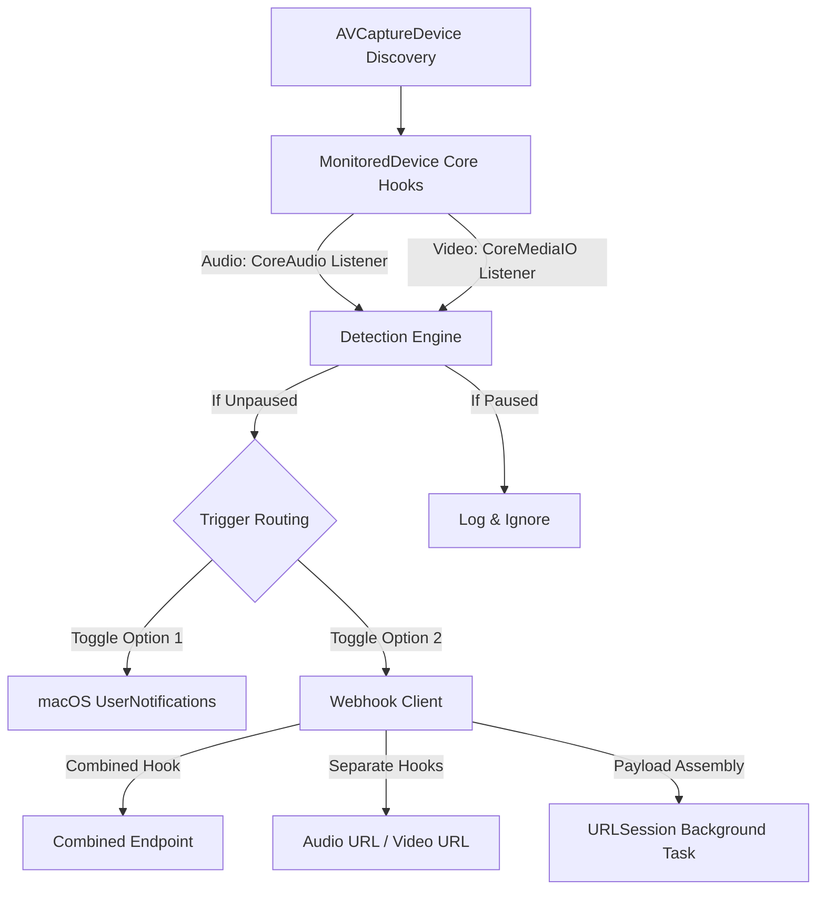

# In Meeting — macOS Status Monitor

**In Meeting** is a lightweight, high-performance macOS Menu Bar application that monitors the hardware activation state of connected camera and microphone devices in real-time. When a device becomes active or inactive, the utility instantly dispatches user-configured webhooks (e.g. to control smart lights, Home Assistant, Slack status, or web portals) and schedules native macOS notifications.

Unlike heavy log-polling scripts, **In Meeting** relies entirely on native macOS framework observers, resulting in near-zero CPU and battery impact.

---

## Key Features

- **Direct Hardware Observers**: Connects directly to CoreAudio (microphones) and CoreMediaIO (cameras) registry notifications to detect state transitions instantly.
- **Menu Bar Status Integration**: Runs exclusively as a Menu Bar accessory with outline, recording, and slash icons representing current idle, active, or paused states.
- **Launch at Login**: Integrates with the modern macOS 13+ `SMAppService` API to launch automatically when you log in.
- **Webhook Integrations**:
  - Supports **Combined URLs** (sending all video/audio events to single active/inactive endpoints) or **Separate URLs** (individual URLs for audio active, audio inactive, video active, and video inactive).
  - Supports **GET** and **POST** methods.
  - Safely **percent-encodes** parameter placeholder values (like `{{device_name}}`) in URL queries to support devices with spaces or parentheses.
  - Custom JSON payload builder for POST requests with placeholder tokens (`{{device_name}}`, `{{device_type}}`, `{{device_status}}`, `{{timestamp}}`).
  - **Fault Tolerance**: Automatic background retries up to **3 times** with exponential backoff on connection or server (5xx) errors.
- **Local macOS Notifications**: Triggers native User Notification banners with status summaries matching PRD guidelines.
- **UI Settings Panel**: A clean, modern SwiftUI window that avoids typical macOS Form alignment bugs.

---

## Architecture Overview



---

## System Requirements

- **Operating System**: macOS 13.0+
- **Sandbox Status**: Disabled (`com.apple.security.app-sandbox` set to `false` in entitlements to allow access to global hardware CoreAudio/CoreMediaIO registers).

---

## How to Build and Run

### Option 1: Build & Run with Xcode UI (Recommended)
1. Double-click [In Meeting.xcodeproj](In%20Meeting.xcodeproj) to open the project in Xcode.
2. Select the target scheme **In Meeting** from the scheme selector in the top toolbar.
3. Click the **Run** button (or press `⌘R`) to build and launch the application.

### Option 2: Build from Command Line
Because macOS command-line tool chains might point to standalone CommandLineTools without default Swift compiler flags for app targets, explicitly set the `DEVELOPER_DIR` variable to build using the Xcode bundle toolchain:

```bash
DEVELOPER_DIR=/Applications/Xcode.app/Contents/Developer xcodebuild -project "In Meeting.xcodeproj" -scheme "In Meeting" clean build
```

### Run from Command Line
To view stdout transition logs in real-time, launch the compiled binary directly from the terminal (using the home folder variable `~/`):

```bash
~/Library/Developer/Xcode/DerivedData/In_Meeting-<hash>/Build/Products/Debug/In\ Meeting.app/Contents/MacOS/In\ Meeting
```

---

## Implementation Structure

- [AppDelegate.swift](In%20Meeting/AppDelegate.swift): App lifecycle entry point, dynamic status menu assembly, and device hot-plug/change observation.
- [NotificationManager.swift](In%20Meeting/NotificationManager.swift): Schedules native system alerts.
- [SettingsManager.swift](In%20Meeting/SettingsManager.swift): Manages `UserDefaults` storage and synchronizes Launch at Login.
- [SettingsView.swift](In%20Meeting/SettingsView.swift): SwiftUI view displaying user configuration options.
- [SettingsWindowController.swift](In%20Meeting/SettingsWindowController.swift): Native window controller host for the settings viewport.
- [WebhookManager.swift](In%20Meeting/WebhookManager.swift): Manages placeholder formatting and asynchronous HTTP execution with retry logic.
