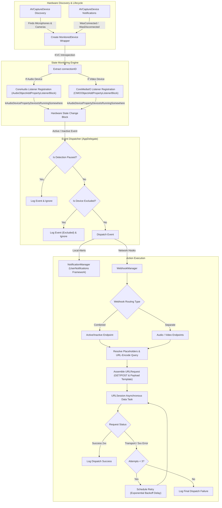

# Product Requirement Document (PRD): "In Meeting" macOS Utility

**Document Version:** 1.0.0  
**Date:** July 8, 2026  
**Status:** Approved  
**Target Platform:** macOS 13.0+ (Swift / Native)  

---

## 1. Executive Summary & Objective

### 1.1 Overview
**"In Meeting"** is a lightweight, high-performance macOS status bar (Menu Bar) application that runs completely in the background without a persistent window footprint. It monitors the hardware activation state of system cameras and microphones in real-time. On state transitions (e.g., when a camera turns on or off), the app triggers user-configured webhooks and local macOS notifications.

### 1.2 Objective & Core Value Proposition
- **Objective:** Provide a low-power, sandbox-free macOS utility to bridge physical/virtual device activity with external automation tools (e.g., smart lights, Home Assistant, Slack status indicators).
- **Core Value:** Unlike polling-based solutions or heavy log stream parsers, "In Meeting" leverages native macOS CoreAudio and CoreMediaIO property listener blocks to respond instantly with near-zero CPU and battery impact.

---

## 2. User Experience & User Interface (UX/UI)

The application must follow macOS design guidelines, adopting native components and spacing to feel like a built-in system utility.

### 2.1 Menu Bar (Status Item)
- **Presence:** The app runs exclusively as a macOS Menu Bar extra (no Dock icon, no main window on startup).
- **Status Item Icon:**
  - **Idle State:** A subtle, monochromatic camera outline (using SF Symbol `video`).
  - **Active State (Device in Use):** A filled recording circle indicator (using SF Symbol `record.circle.fill`).
  - **Paused State:** A camera outline with a slash (using SF Symbol `video.slash`).
- **Status Menu (Left-Click Menu):**
  - **Monitored Devices & Exclusions:** Displays a list of monitored devices with checkmarks on their left (checked by default, meaning enabled). Users can click a device item to toggle its checkmark (enable/exclude it from alerts). Displays emojis indicating status: 🔴 (active) or ⚪ (idle), type symbols 📹 (video) or 🎤 (audio), the device name, and text state (Active/Idle).
  - **Pause Detection / Resume Detection:** A toggle item that temporarily halts event triggers.
  - **Preferences... / Settings...:** Opens the settings window (Keyboard Shortcut: `⌘,`).
  - **About:** Opens `https://example.com` in the default web browser (to be replaced with actual project site).
  - **Quit:** Terminates the application (Keyboard Shortcut: `⌘Q`).

### 2.2 Settings Window (Preferences UI)
A native-feeling tabbed or sidebar preferences window containing the following sections:

#### Tab 1: General & Notifications
- **Launch at Login:** Checkbox to launch the app automatically. Implemented via macOS 13+ `SMAppService.mainApp` API.
- **Enable Notifications:** Checkbox to toggle native macOS User Notifications.
  - Sub-option: **Notify on Activation** (e.g., "Camera FaceTime HD Camera is now Active").
  - Sub-option: **Notify on Deactivation** (e.g., "Microphone FaceTime HD is now Inactive").

#### Tab 2: Webhooks Configuration
- **Webhook Integration Type:** Radio button group selector to choose between:
  - `Combined URL` (Use a single webhook URL for all audio/video events).
  - `Separate URLs` (Configure individual webhook URLs for Audio and Video events).
- **Endpoint Settings:**
  - **Method Selector:** Segmented control to choose between `GET` and `POST`.
  - **Description Caption:** A caption showing dynamic explanation details based on the selected method.
  - **URL Input Field:** Placeholder indicating expected format (e.g., `https://api.example.com/webhook`).
  - **Active Event Webhook URL:** The target URL triggered when a device becomes active.
  - **Inactive Event Webhook URL:** The target URL triggered when a device becomes inactive.
- **Templating / Payload Customization:**
  - Checkbox: **Enable Custom Payload Template** (If unchecked, calls the URL as a simple parameterless/header-only ping, or sends a standard payload).
  - **Custom Payload Editor:** A text area allowing JSON input. Support the following template placeholder tokens:
    - `{{device_name}}`: The localized name of the device (e.g., "FaceTime HD Camera").
    - `{{device_type}}`: The medium type, either `camera` or `microphone`.
    - `{{device_status}}`: The new status, either `active` or `inactive`.
    - `{{timestamp}}`: ISO 8601 formatted timestamp of the event.
  - **Test Webhook Button & Inline Feedback:** Allows the user to trigger a sample webhook call with fake details to verify connection and payload formatting. Displays a progress loader (`ProgressView`) during testing, followed by a status message confirming success or specifying validation/transport errors.
  - **URL Input Validation:** Each endpoint field highlights errors and disables testing or dispatch if the entered string is not a valid URL formatting structure.

---

## 3. Detailed Functional Requirements

### 3.1 Device Event Engine
- **Hardware Integration:** Continuously monitor `AVCaptureDevice` connections/disconnections.
- **State Capture:** Subscribe to CoreAudio and CoreMediaIO hardware events using:
  - `kAudioDevicePropertyDeviceIsRunningSomewhere` selector.
- **Pause State:**
  - When the user selects **Pause Detection**, the app must unregister listeners or short-circuit callbacks.
  - No webhooks or notifications are fired while paused.
  - When **Resume Detection** is clicked, listeners are re-established or active states are queried immediately to synchronize the current hardware status.
- **Device Exclusions:**
  - Users can exclude specific devices from triggering notifications or webhooks by unchecking them in the status bar menu.
  - The list of excluded device unique IDs is saved to `UserDefaults` under `excludedDeviceIDs` and loaded dynamically at startup.
  - An excluded device's state transitions are ignored for notifications and webhook dispatches, but console logging and status bar icon calculations remain active.

### 3.2 Webhook Request Engine
- **Trigger Execution:** When a state transition occurs (Active <-> Inactive) for any monitored device:
  1. Determine if the device type is Audio or Video.
  2. Retrieve the designated Webhook URL configuration (Combined vs. Separate, Active vs. Inactive).
  3. Compile the payload/URL:
     - **GET Request:** Replace template tokens inside URL query parameters (e.g., `https://api.example.com?device={{device_name}}&status={{device_status}}`).
     - **POST Request:** Compile template tokens into the JSON body payload.
     - **No-Template Mode:** Perform a plain request (GET or POST with empty body).
  4. Perform the HTTP request asynchronously using `URLSession` on a background thread.
- **Fault Tolerance:**
  - Network timeouts must not block the main UI thread.
  - Failed webhook calls should log errors to stdout, and retry up to 3 times with a simple backoff delay on temporary network failures.

### 3.3 macOS System Notifications
- **Implementation:** Utilize the `UserNotifications` framework.
- **Permissions:** Request notification authorization on first activation of the feature.
- **Message Content:**
  - Title: `In Meeting Status Change`
  - Body: `[Active/Inactive] [Camera/Microphone]: [Device Name] is now in use / no longer in use.`

---

## 4. Technical Architecture

### 4.1 Technology Stack
- **Languages:** Swift 5+
- **Frameworks:**
  - Cocoa / AppKit (for the Status Bar item and menu integration).
  - SwiftUI (highly recommended for modern, clean Settings UI views).
  - Foundation (for URLSession and data processing).
  - UserNotifications (for local OS notification support).
- **Persistence:** `UserDefaults` for lightweight storage of settings, URLs, templates, and flags.

### 4.2 Security & Entitlements
- **Sandbox Status:** App Sandbox must remain **Disabled** (`com.apple.security.app-sandbox = false`) to access global CoreAudio and CoreMediaIO property registries.
- **Privacy Permissions:** Include proper strings in `Info.plist` for:
  - Camera Access Description (`NSCameraUsageDescription`).
  - Microphone Access Description (`NSMicrophoneUsageDescription`).

---

## 5. Non-Functional Requirements

- **Resource & Power Management:**
  - **Memory:** Footprint must stay under 40 MB.
  - **CPU:** Near 0.0% CPU when idle (devices not changing state). Direct block callbacks eliminate polling overhead.
  - **Network:** Non-blocking asynchronous requests; timeout set to a reasonable limit (e.g., 5-10 seconds) to prevent hanging threads.
- **Robustness:** Handles dynamic plugin/unplug of audio/video devices gracefully (updating list of observed connections dynamically).

---

## 6. Resolved Design & Technical Decisions

The following design and technical decisions have been finalized based on user feedback:

- **Settings Window UI Framework:** Built using **SwiftUI**, maintaining a clean, modern preferences form.
- **Webhook Headers & Content-Type:** Default `application/json` payload structure for POST requests is sufficient; no custom headers needed for PoC.
- **Webhook Retry Policy:** Failed webhook calls (e.g. network timeout or connection lost) will be retried up to **3 times** before logging a final error.
- **Menu Bar Icon Design:** Uses a **single unified icon** that represents overall status (active device, paused detection, or idle state).
- **Notification Text:** Standard system notification message layout is sufficient. Custom templates are not required.
- **Menu Interactivity and Enablement:** Setting `statusMenu.autoenablesItems = false` ensures that custom items aren't disabled automatically. Monitored device items are set to `isEnabled = true` to allow click-to-toggle checkmark interactions. Clicking a device item toggles its exclusion state (checked = enabled, unchecked = excluded). Control buttons (Pause, Settings, About, Quit) are explicitly marked `isEnabled = true`.
- **Input Validation:** Webhook URL endpoints are validated in real-time, preventing request dispatches or simulations to incomplete or faulty destinations.
- **Nordic Frost Landing Page:** Implemented a sleek, responsive landing website inside the `docs/` folder (GitHub Pages compatible), facilitating Homebrew (`brew install in-meeting`) or Xcode-based compilation steps, explaining architecture, and reinforcing privacy policies (no trackers/analytics).

